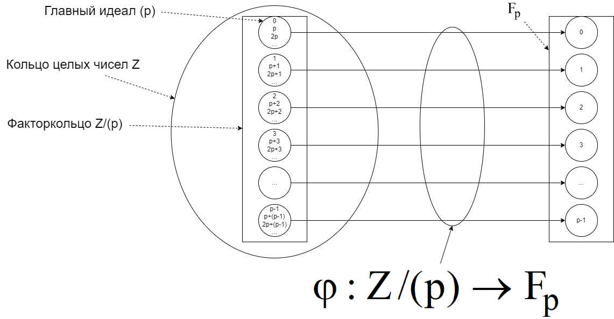
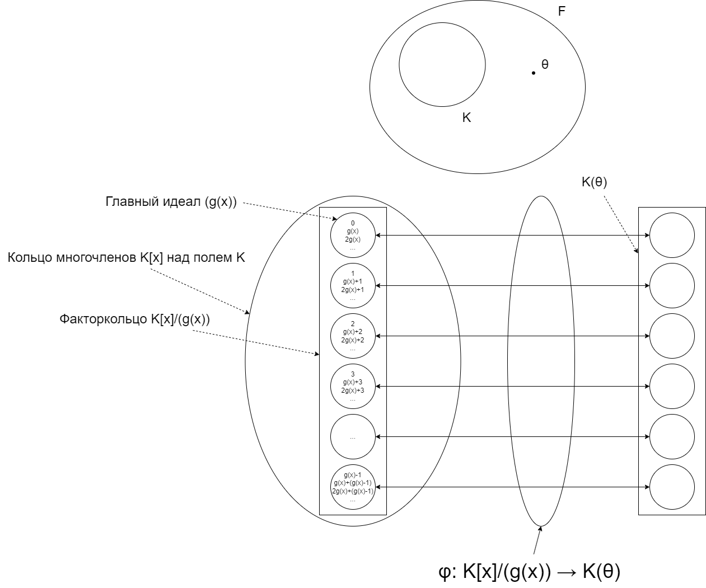

# Пример кода БЧХ и кода Рида-Соломона

Если необходима математическая база для понимания кода БЧХ и кода Рида-Соломона, то посоветую книгу:  Лидл. Р., Нидеррайтер Г. «Конечные поля».  Данная книга помогает мне до сих пор.
Советую прочитать следующее:

1. Глава 1. § 1 Группы. (Бинарная операция, группа, *n*-ая степень элемента *a*, мультипликативное обозначение, аддативное обозначение, циклическая группа, порядок группы, подгруппа, гомоморфизм, изоморфизм, факторгруппа)
2. Глава 1. § 2 Кольца и поля. (Кольцо, поле, идеал, главный идеал, факторкольцо, поле Галуа порядка p, характеристика кольца)

3. Глава 1. § 3 Многочлены. (Многочлен над кольцом, кольцо многочленов над кольцом, неприводимый многочлен на кольцом, корень многочлена)
4. Глава 1. § 4 Расширения полей. (Советую внимательно прочитать и осознать данную главу)

5. Глава 2. § 1 Характеризация конечных полей. (Только поверхностно)
6. Глава 2. § 2 Корни неприводимых многочленов. (Только поверхностно)
7. Глава 2. § 3 Следы, нормы и базисы. (Только поверхностно, базис и нормальный базис)
8. Глава 2. § 4 Корни из единицы и круговые многолены. (Только поверхностно, примерно можно взять из комплексных чисел.)
9. Глава 2. § 5 Представление элементов конечных полей. (Первый способ)
Если не открываются Jupyter Notebook, то используйте проект [тут](https://nbviewer.org/github/Chistousov/BCH-and-Reed-Solomon/tree/main/).

## Creators

Nikita Konstantinovich Chistousov

chistousov.nik@yandex.ru

## License

MIT
